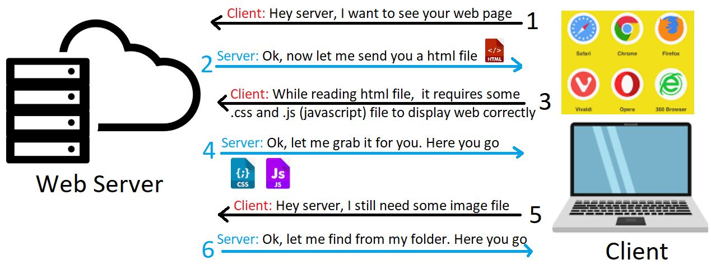
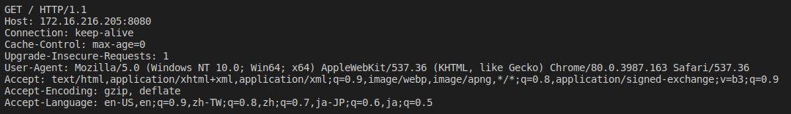
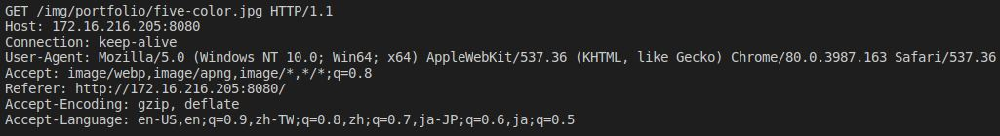
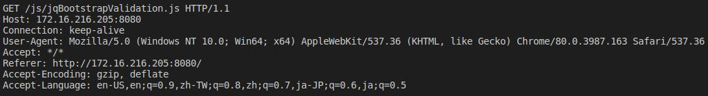

# Socket Programming Mini Projects 
Computer Networks - Fall 2022
* Mohammad Pooya Afshari - 810198577
* Mohammad Reza Sheshpari - 
## Web Server
Implemented a simple HTTP Web Server using cpp and socket programming, on http://localhost:18000.

Any bad sequence would respond 404.html
> http://localhost:18000/404.html

Normal requests would be redirected to  ```index.html```  
> http://localhost:18000/index.html

---
A good reading resource for Implementing a simple web-server would be:  <a href="https://medium.com/from-the-scratch/http-server-what-do-you-need-to-know-to-build-a-simple-http-server-from-scratch-d1ef8945e4fa"> Medium-HTTP Server from scratch</a>

## 1.Basic Knowledge
Internet is based on server-client architecture. Server who can serve multiple clients and clients using web browsers can communicate with servers.



The following image shows basically how a web server using socket will work.


##  2.Parse the Request from the Client

If we look at a simple Get request from client, we will face something like this:



The structure is the same for JS, PDF, JPEG, and etc.




Also HTTPS use same patterns plus encryption. 
The root of this structure is:   


`HTTP Version + Return-code + \n(Linux) OR \r\n(Windows) + Content-type (LIKE:"text/html) + \n(Linux) OR \r\n(Windows) + \n(Linux) OR \r\n(Windows)`


Something like below:


```
HTTP/1.1 200 Ok\r\n
Content-Type: text/html\r\n\r\n
```
## Content-types

Here we list out some common file extension and their Content Type.
<p align="center">
<table>
    <thead>
        <tr>
            <th align="center">File Extension</th>
            <th align="center">Content Type Type</th>
        </tr>
    </thead>
    <tbody>
        <tr>
            <td align="center">.css</td>
            <td align="Left">text/css</td>
        </tr>
        <tr>
            <td align="center">.html</td>
            <td align="Left">text/html</td>
        </tr>
        <tr>
            <td align="center">.ico</td>
            <td align="Left">image/vnd.microsoft.icon</td>
        </tr>
        <tr>
            <td align="center">.jpg</td>
            <td align="Left">image/jpeg</td>
        </tr>
        <tr>
            <td align="center">.js</td>
            <td align="Left">text/javascript</td>
        </tr>
         <tr>
            <td align="center">.pdf</td>
            <td align="Left">application/pdf</td>
        </tr>
         <tr>
            <td align="center">.gif</td>
            <td align="Left">image/gif</td>
        </tr>
        <tr>
            <td align="center">.json</td>
            <td align="Left">application/json</td>
        </tr>
        <tr>
            <td align="center">.ttf</td>
            <td align="Left">font/ttf</td>
        </tr>
        <tr>
            <td align="center">.txt</td>
            <td align="Left">text/plain</td>
        </tr>
        <tr>
            <td align="center">.woff</td>
            <td align="Left">font/woff</td>
        </tr>
        <tr>
            <td align="center">.xml</td>
            <td align="Left">text/xml</td>
        </tr>
        <tr>
            <td align="center">.mp3</td>
            <td align="Left">audio/mpeg</td>
        </tr>
        <tr>
            <td align="center">.mpeg</td>
            <td align="Left">video/mpeg</td>
        </tr>
       <tr>
            <td align="center">.m3u8</td>
            <td align="Left">application/vnd.apple.mpegurl</td>
        </tr>
       <tr>
            <td align="center">.ts</td>
            <td align="Left">video/mp2t</td>
        </tr>
    </tbody>
</table>
</p>

<a href="https://developer.mozilla.org/en-US/docs/Web/HTTP/Basics_of_HTTP/MIME_types">More Content Types Here</a>

## Explain files
